# Check Network Interface

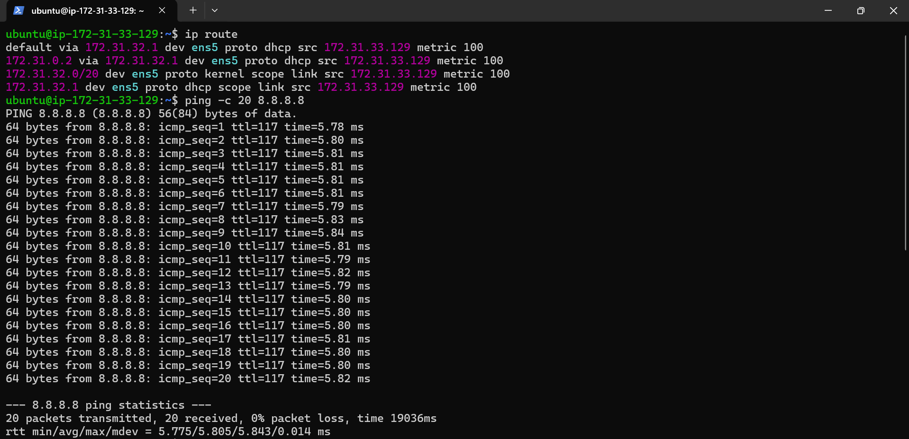
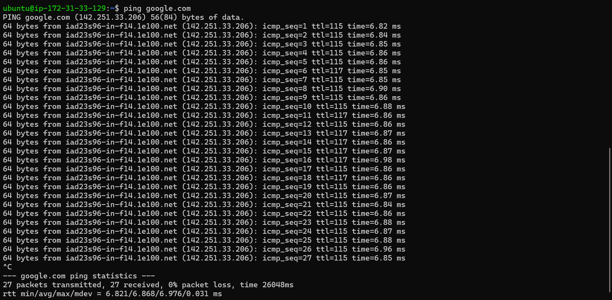
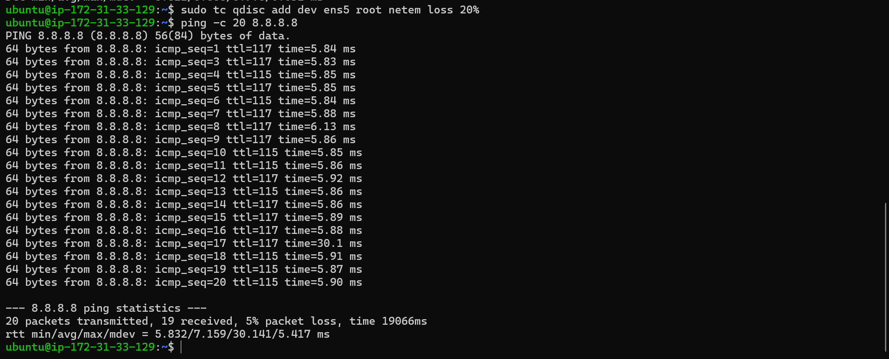
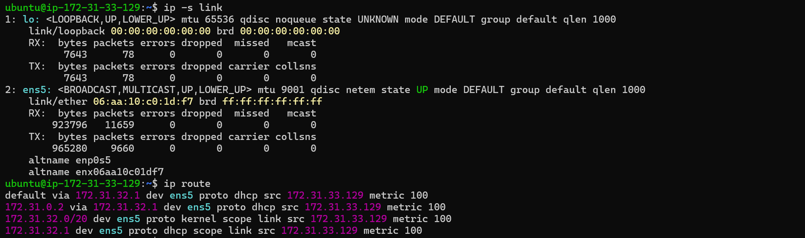
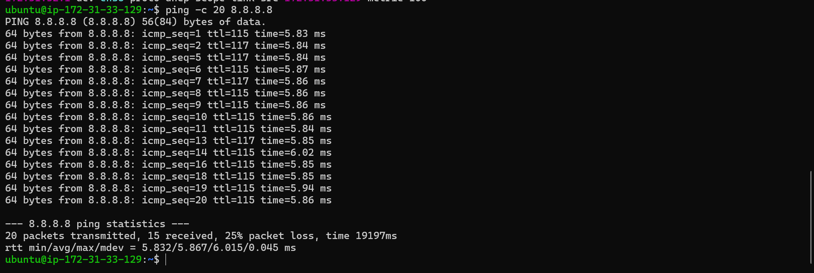
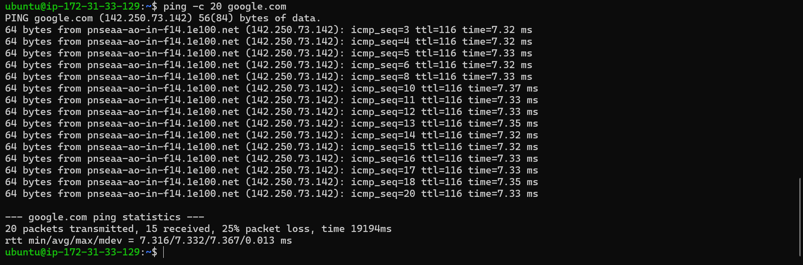
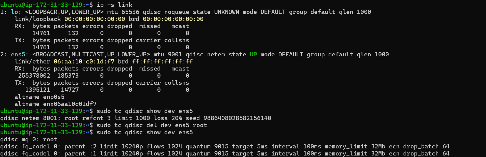
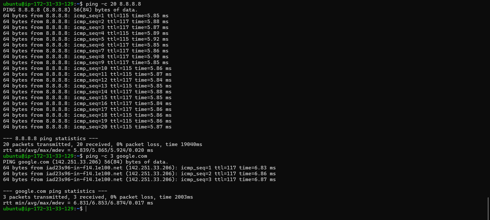
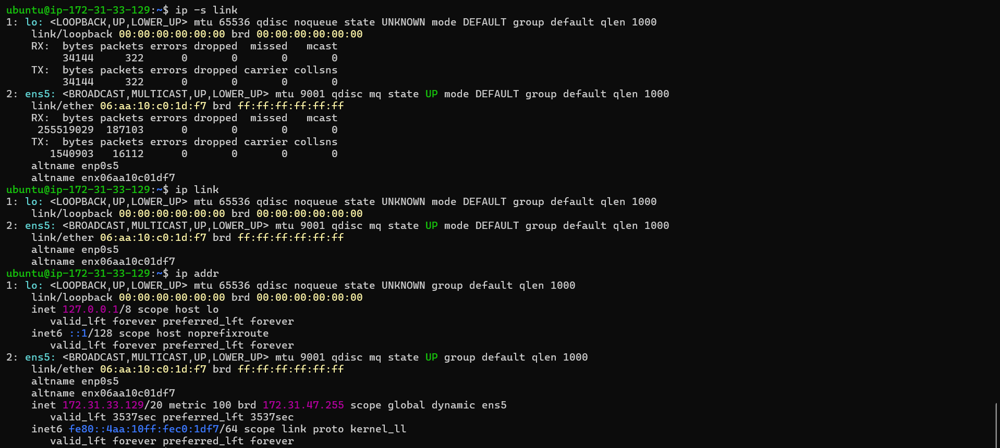
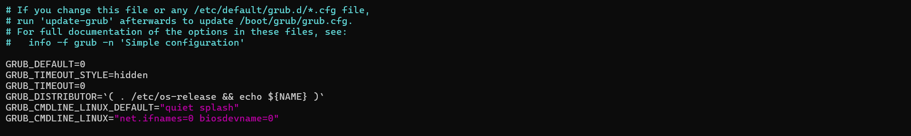
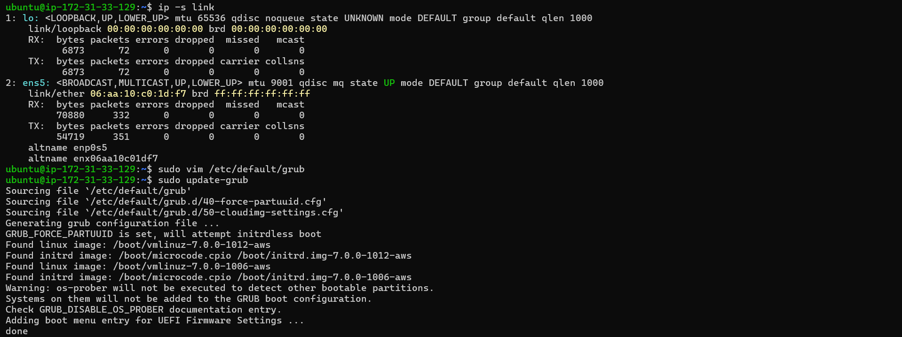
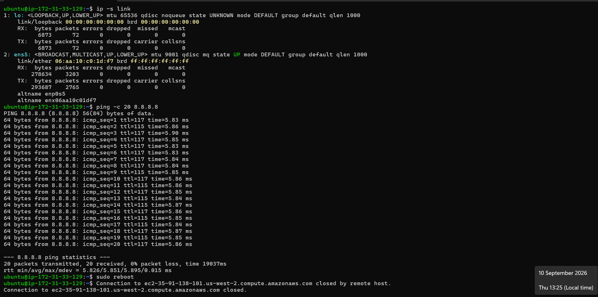

# 🚨 Scenario 1 — Packet Loss

## 🎯 Goal

Create **20% packet loss** on an AWS EC2 instance and then troubleshoot the intentionally introduced network problem as if it were a real production incident.

> ⚠️ **Lab Warning:** This exercise intentionally disrupts network traffic on the EC2 instance. Perform it only on a test/lab instance where temporary connectivity problems are acceptable.

---

# 🏗️ Scenario Overview

We will intentionally introduce packet loss using Linux `tc` (Traffic Control) and the `netem` network emulator.

```text
                EC2 Instance
                     │
                     ▼
              Network Interface
                     │
                     ▼
              Linux Traffic Control
                     │
                     ▼
              20% Packet Loss ❌
```

The troubleshooting scenario will be:

> 🚨 **EC2 server has intermittent network connectivity and packet loss.**

---

# 1. 🔐 Login to EC2

Connect to your EC2 instance using SSH:

```bash
ssh -i your-key.pem ubuntu@<EC2-IP>
```

Example:

```bash
ssh -i my-key.pem ubuntu@54.123.45.67
```

---

# 2. 🌐 Find Your Network Interface

Run:

```bash
ip route
```

You may see something like:

```text
default via 10.0.1.1 dev ens5
```

Here:

```text
ens5
```

is the network interface.

You can also identify interfaces with:

```bash
ip link
```

or:

```bash
ip -br link
```

---

# 3. ✅ Confirm Everything Is Healthy

Before introducing the problem, verify network connectivity.

Run:

```bash
ping -c 20 8.8.8.8
```

Expected output should be similar to:

```text
20 packets transmitted, 20 received, 0% packet loss
```

The exact latency will depend on your network and AWS environment.

At this point:

```text
EC2
 │
 └── Network
       │
       └── Healthy ✅
```

---

# 4. 🔥 Create 20% Packet Loss

Now intentionally introduce packet loss using `tc`.

Replace `ens5` with your actual network interface if it is different.

```bash
sudo tc qdisc add dev ens5 root netem loss 20%
```

### What does this command mean?

```text
tc
│
├── Traffic Control
│
qdisc
│
├── Queueing Discipline
│
netem
│
└── Network Emulator
```

The command:

```bash
sudo tc qdisc add dev ens5 root netem loss 20%
```

means:

> Add a network-emulation queueing discipline to interface `ens5` that randomly drops approximately 20% of packets.

The network now looks like:

```text
EC2 Linux
    │
    ▼
Network Interface
    │
    ▼
   netem
    │
    ├── Packet → ✅
    ├── Packet → ✅
    ├── Packet → ❌ Dropped
    ├── Packet → ✅
    ├── Packet → ❌ Dropped
    └── Packet → ✅
```

---

# 5. 🔍 Confirm the Fault Exists

Run:

```bash
ping -c 20 8.8.8.8
```

You should see approximately:

```text
20 packets transmitted
~16 packets received
~20% packet loss
```

For example:

```text
20 packets transmitted, 16 received, 20% packet loss
```

> ⚠️ Packet loss is randomized, so you may not get exactly 20% with only 20 packets. A larger number of packets gives a more representative result.

For example:

```bash
ping -c 100 8.8.8.8
```

You should see a result closer to:

```text
100 packets transmitted
~80 received
~20% packet loss
```

---

# 6. 🚨 Troubleshooting Begins

Now pretend that you **don't know what caused the packet loss**.

Your incident is:

> 🚨 **EC2 server has intermittent network connectivity and packet loss.**

You now need to troubleshoot the problem like a DevOps/SRE engineer.

---

# 7. 🔎 Check Network Interface Statistics

Start with:

```bash
ip -s link
```

This displays network interface statistics such as:

* RX packets
* RX errors
* RX dropped
* TX packets
* TX errors
* TX dropped

Example:

```text
RX:
    packets
    errors
    dropped

TX:
    packets
    errors
    dropped
```

### What are you looking for?

Check whether the interface shows:

```text
RX errors
RX dropped
TX errors
TX dropped
```

Unexpected increases can indicate a network or interface problem.

---

# 8. 🛣️ Check Routing

Run:

```bash
ip route
```

Example:

```text
default via 10.0.1.1 dev ens5
10.0.1.0/24 dev ens5 proto kernel scope link src 10.0.1.25
```

Verify:

* Default gateway exists
* Correct interface is being used
* Expected network route exists
* Source IP is correct

---

# 9. 🏠 Test the Default Gateway

Find your gateway:

```bash
ip route
```

Example:

```text
default via 10.0.1.1 dev ens5
```

The gateway is:

```text
10.0.1.1
```

Test it:

```bash
ping -c 20 10.0.1.1
```

Or:

```bash
ping -c 20 <gateway-ip>
```

### Why test the gateway?

This helps isolate the problem.

If the gateway itself shows packet loss:

```text
EC2
 ↓
Gateway
 ↓
❌ Packet Loss
```

the problem may be closer to the local interface/network path.

If the gateway is healthy but an external destination has packet loss:

```text
EC2
 ↓
Gateway
 ↓
AWS Network
 ↓
Internet
 ↓
8.8.8.8
       ❌
```

you investigate the next part of the path.

---

# 10. 🌍 Test External Connectivity

Run:

```bash
ping -c 20 8.8.8.8
```

Compare the results with the gateway test.

### Possible results

#### Case 1 — Gateway has packet loss

```text
Gateway → 20% packet loss
Internet → 20% packet loss
```

Investigate:

* Network interface
* Local routing
* Traffic control
* Instance networking
* AWS networking configuration

---

#### Case 2 — Gateway is healthy

```text
Gateway → 0% packet loss
Internet → 20% packet loss
```

Investigate:

* Routing
* NAT/Internet Gateway path
* Security/network configuration
* External network path
* Traffic control configuration

---

# 11. 🧪 Check Traffic Control Configuration

Since `tc` was used to introduce the fault, you can inspect the active queueing discipline:

```bash
tc qdisc show dev ens5
```

You may see something similar to:

```text
qdisc netem ... loss 20%
```

This is the hidden cause of the lab failure.

In a real incident, the equivalent might be:

* Incorrect network configuration
* Traffic shaping
* Misconfigured routing
* Network interface issues
* Firewall rules
* Infrastructure changes

---

# 12. 🛠️ Remove the Packet Loss

Once you identify the problem, remove the `netem` configuration.

Run:

```bash
sudo tc qdisc del dev ens5 root
```

Replace `ens5` with your actual interface.

---

# 13. ✅ Verify Recovery

Run:

```bash
ping -c 20 8.8.8.8
```

You should return to normal connectivity, typically showing:

```text
20 packets transmitted
20 received
0% packet loss
```

You can also verify the queueing discipline:

```bash
tc qdisc show dev ens5
```

The `netem loss 20%` configuration should no longer be present.

---

# 14. 🔄 Complete Troubleshooting Flow

The complete exercise looks like this:

```text
             START
               │
               ▼
          Login to EC2
               │
               ▼
          Find Interface
               │
               ▼
       Check Network Health
               │
               ▼
       Introduce 20% Loss
               │
               ▼
        Verify Packet Loss
               │
               ▼
       🚨 INCIDENT START
               │
               ▼
       ip -s link
               │
               ▼
          ip route
               │
               ▼
       Ping Gateway
               │
               ▼
       Ping 8.8.8.8
               │
               ▼
      Check tc Configuration
               │
               ▼
        Identify Root Cause
               │
               ▼
      Remove Faulty Config
               │
               ▼
       Test Connectivity
               │
               ▼
           0% Loss ✅
               │
               ▼
           INCIDENT
           RESOLVED
```

---

# 15. 🧠 Commands Cheat Sheet

## Find network interface

```bash
ip route
```

```bash
ip link
```

```bash
ip -br link
```

---

## Test connectivity

```bash
ping -c 20 8.8.8.8
```

```bash
ping -c 20 <gateway-ip>
```

---

## Check interface statistics

```bash
ip -s link
```

---

## Add 20% packet loss

```bash
sudo tc qdisc add dev ens5 root netem loss 20%
```

---

## Check traffic-control configuration

```bash
tc qdisc show dev ens5
```

---

## Remove packet loss

```bash
sudo tc qdisc del dev ens5 root
```

---

# 16. 🧩 Key Concepts

### `ping`

Used to test IP connectivity and measure packet loss and latency.

```bash
ping -c 20 8.8.8.8
```

---

### `ip route`

Displays the Linux routing table.

```bash
ip route
```

Useful for identifying:

* Default gateway
* Network interface
* Routes
* Source addresses

---

### `ip -s link`

Displays network interface statistics.

```bash
ip -s link
```

Useful for checking:

* RX packets
* TX packets
* Errors
* Dropped packets

---

### `tc`

Linux **Traffic Control** is used to configure packet processing, queueing, traffic shaping, and network emulation.

```bash
tc
```

---

### `netem`

`netem` is a Linux network emulator that can introduce network conditions such as:

* Packet loss
* Delay
* Duplication
* Corruption
* Reordering

Example:

```bash
sudo tc qdisc add dev ens5 root netem loss 20%
```

---

# 17. 🎯 DevOps / SRE Learning

This exercise demonstrates an important production troubleshooting mindset:

```text
Observe
   ↓
Measure
   ↓
Isolate
   ↓
Test
   ↓
Identify Root Cause
   ↓
Fix
   ↓
Verify
   ↓
Document
```

Instead of immediately changing configurations, first collect evidence.

### Example

```text
Symptom:
Packet loss
    ↓
Check:
ip -s link
    ↓
Check:
ip route
    ↓
Test:
Gateway
    ↓
Test:
Internet
    ↓
Inspect:
tc qdisc
    ↓
Root Cause:
netem loss 20%
    ↓
Fix:
Delete qdisc
    ↓
Verify:
ping
    ↓
Result:
0% packet loss ✅
```

---

# 18. 🏆 Interview Question

### Q: How would you troubleshoot packet loss on an EC2 instance?

A good troubleshooting approach:

```text
1. Check interface statistics
   ↓
   ip -s link

2. Check routing
   ↓
   ip route

3. Test local gateway
   ↓
   ping <gateway-ip>

4. Test external connectivity
   ↓
   ping 8.8.8.8

5. Check traffic-control configuration
   ↓
   tc qdisc show dev <interface>

6. Investigate AWS networking
   ↓
   Security Groups
   Route Tables
   Network ACLs
   NAT Gateway / Internet Gateway
   VPC configuration

7. Fix the root cause

8. Verify packet loss is resolved
```

> **Never assume the cause from the symptom alone. Start with evidence and progressively isolate where the packet loss occurs.**

---

# 📌 Final Summary

In this lab you learned how to:

* ✅ Connect to an EC2 instance
* ✅ Identify the network interface
* ✅ Test network connectivity
* ✅ Create intentional packet loss
* ✅ Use `tc` and `netem`
* ✅ Inspect network interface statistics
* ✅ Check routing
* ✅ Test the gateway
* ✅ Test external connectivity
* ✅ Identify the traffic-control configuration
* ✅ Remove the fault
* ✅ Verify recovery
* ✅ Follow a structured DevOps/SRE troubleshooting process

### Final Mental Model

```text
                🚨 PACKET LOSS
                      │
                      ▼
              Is the interface OK?
                      │
                      ▼
                Is routing OK?
                      │
                      ▼
             Is gateway reachable?
                      │
                      ▼
             Is Internet reachable?
                      │
                      ▼
            Is traffic being altered?
                      │
                      ▼
                Find root cause
                      │
                      ▼
                  Fix it
                      │
                      ▼
                Verify again
                      │
                      ▼
                   ✅ RESOLVED
```

> **Troubleshooting is not guessing — it is systematically collecting evidence, isolating the failure, fixing the root cause, and verifying recovery.**
