# Linux Network Troubleshooting 

## Scenario — High Network Latency / Packet Loss

### Problem

> **The Linux server is experiencing slow network connectivity and packet loss. How would you troubleshoot it?**

The goal is to troubleshoot the problem step by step instead of randomly running commands.

---

# 🧭 Overall Troubleshooting Flow

```text
Problem Reported
      │
      ▼
1. Check Network Interface
      │
      ▼
2. Check IP / Route / Gateway
      │
      ▼
3. Ping Gateway
      │
      ▼
4. Ping External IP
      │
      ▼
5. Check Latency / Packet Loss
      │
      ▼
6. Check DNS
      │
      ▼
7. Check Interface Errors
      │
      ▼
8. Check Bandwidth / Connections
      │
      ▼
9. Trace Network Path
      │
      ▼
10. Check Server / Application
```

---

# STEP 1 — Check Network Interface

First, check whether the network interface is **UP** and has the expected IP address.

### Check interface

```bash
ip link
```

### Check IP address

```bash
ip addr
```

Short version:

```bash
ip a
```

### Check interface statistics

```bash
ip -s link
```

For a specific interface:

```bash
ip -s link show eth0
```

> Replace `eth0` with your actual interface, such as `ens5`.

### Check

```text
Interface        → UP?
IP Address       → Correct?
RX packets       → Increasing?
TX packets       → Increasing?
RX errors        → High?
TX errors        → High?
Dropped packets  → High?
```

If the interface and IP configuration look correct:

```text
Move → STEP 2
```

---

# STEP 2 — Check Routing and Default Gateway

Now check whether Linux has the correct route and default gateway.

### Check routing table

```bash
ip route
```

Short version:

```bash
ip r
```

Example:

```text
default via 192.168.1.1 dev eth0
192.168.1.0/24 dev eth0 proto kernel scope link src 192.168.1.10
```

Here:

```text
192.168.1.10  → Linux server IP
192.168.1.1   → Default Gateway
eth0          → Network Interface
```

### Check route to a specific destination

```bash
ip route get 8.8.8.8
```

This shows which interface and gateway Linux will use.

If the route is correct:

```text
Move → STEP 3
```

---

# STEP 3 — Ping the Default Gateway

Now test the **local network path**.

```bash
ping -c 10 192.168.1.1
```

Replace `192.168.1.1` with your actual gateway.

Expected:

```text
10 packets transmitted, 10 received, 0% packet loss
```

### Good result

```text
0% packet loss
Low and stable latency
```

Network path:

```text
Linux Server
     │
     ▼
Network Interface
     │
     ▼
Local Network
     │
     ▼
Default Gateway
```

If the gateway test is good:

```text
Move → STEP 4
```

> ⚠️ A failed ping to the gateway does not always prove the gateway is down. The gateway may simply block ICMP traffic.

---

# STEP 4 — Ping an External IP

Now check whether the problem exists beyond the local network.

Use an IP address first so DNS does not affect the test.

```bash
ping -c 10 8.8.8.8
```

Another example:

```bash
ping -c 10 1.1.1.1
```

Check:

```text
Packet loss
Minimum latency
Average latency
Maximum latency
```

Example:

```text
10 packets transmitted, 10 received, 0% packet loss
rtt min/avg/max/mdev = 20/25/30/4 ms
```

If external connectivity is good:

```text
Move → STEP 5
```

---

# STEP 5 — Check Latency and Packet Loss

`ping` gives basic latency and packet-loss information.

For deeper troubleshooting, use **MTR**.

### Check if MTR is installed

```bash
mtr --version
```

### Install MTR

Ubuntu/Debian:

```bash
sudo apt update
sudo apt install mtr
```

RHEL/CentOS:

```bash
sudo yum install mtr
```

On newer RHEL-based systems:

```bash
sudo dnf install mtr
```

### Run MTR

```bash
mtr -rw 8.8.8.8
```

Or run 100 probes:

```bash
mtr -r -c 100 8.8.8.8
```

### What is MTR?

MTR combines:

```text
ping + traceroute
```

It helps identify where latency or packet loss may begin along the network path.

Example:

```text
HOST              Loss%   Avg
192.168.1.1        0%     1ms
10.10.0.1          0%     5ms
ISP Router         5%    20ms
8.8.8.8            5%    25ms
```

### Important

Packet loss at an **intermediate hop alone** does not necessarily mean that router is faulty.

Some routers rate-limit or deprioritize ICMP responses.

Look for loss that **continues to the destination**.

If MTR looks normal:

```text
Move → STEP 6
```

---

# STEP 6 — Check DNS

Sometimes users report:

> "Internet is slow."

But the actual problem is DNS resolution.

### Test DNS with `nslookup`

```bash
nslookup google.com
```

### Test DNS with `dig`

```bash
dig google.com
```

### Test a specific DNS server

```bash
dig @8.8.8.8 google.com
```

### Check DNS configuration

```bash
cat /etc/resolv.conf
```

For systems using `systemd-resolved`:

```bash
resolvectl status
```

### Compare IP and hostname

First:

```bash
ping -c 5 8.8.8.8
```

Then:

```bash
ping -c 5 google.com
```

If:

```text
ping 8.8.8.8    → Fast
ping google.com → Slow/Fail
```

Investigate DNS.

If DNS is working:

```text
Move → STEP 7
```

---

# STEP 7 — Check Network Interface Errors

Now investigate the network interface itself.

```bash
ip -s link show eth0
```

Look for:

```text
RX errors
TX errors
RX dropped
TX dropped
Overruns
Carrier errors
```

### Check NIC information

```bash
sudo ethtool eth0
```

### Check NIC statistics

```bash
sudo ethtool -S eth0
```

Look for counters such as:

```text
rx_errors
tx_errors
rx_dropped
tx_dropped
crc_errors
```

### Check link speed

```bash
sudo ethtool eth0
```

Look for:

```text
Speed: 1000Mb/s
Duplex: Full
Link detected: yes
```

Unexpected values such as:

```text
Speed: 100Mb/s
Duplex: Half
```

may indicate a link or configuration problem.

> On cloud instances such as EC2, some physical NIC details are abstracted by the virtualized network environment, so interpret `ethtool` output in the context of the platform.

If interface statistics look normal:

```text
Move → STEP 8
```

---

# STEP 8 — Check Bandwidth and Connections

The server may not actually have packet loss. It could be consuming too much network bandwidth.

### Check socket summary

```bash
ss -s
```

### Check active connections

```bash
ss -tunap
```

### Check listening ports

```bash
ss -lntup
```

### Monitor network traffic

Using `iftop`:

```bash
sudo iftop -i eth0
```

Using `nload`:

```bash
nload
```

If required, install them.

Ubuntu/Debian:

```bash
sudo apt install iftop nload
```

Check whether a process or service is generating unusually high network traffic.

If bandwidth and connections look normal:

```text
Move → STEP 9
```

---

# STEP 9 — Trace the Network Path

Use `traceroute` to see the path to the destination.

```bash
traceroute 8.8.8.8
```

If `traceroute` is unavailable:

```bash
tracepath 8.8.8.8
```

TCP-based traceroute can also be useful when ICMP/UDP traffic is filtered:

```bash
sudo traceroute -T -p 443 google.com
```

Network path:

```text
Linux Server
     │
     ▼
Gateway
     │
     ▼
Router
     │
     ▼
ISP / Cloud Network
     │
     ▼
Internet
     │
     ▼
Destination
```

Look for:

```text
High latency
Packet loss
Unexpected routing
A hop where the problem begins
```

If the network path looks normal:

```text
Move → STEP 10
```

---

# STEP 10 — Check Server and Application

If all network tests look healthy:

```text
Interface       ✅
IP              ✅
Route           ✅
Gateway         ✅
External Ping   ✅
MTR             ✅
DNS             ✅
NIC             ✅
Bandwidth       ✅
Network Path    ✅
```

but the application is still slow, the problem may **not be the network**.

Check the server.

### CPU

```bash
top
```

or:

```bash
htop
```

### Memory

```bash
free -h
```

### Disk space

```bash
df -h
```

### Disk I/O

```bash
iostat
```

### System load

```bash
uptime
```

### Kernel network messages

```bash
dmesg | grep -i network
```

or:

```bash
journalctl -k | grep -i network
```

Now investigate the application, web server, database, or backend service.

---

# 🔥 Troubleshooting Decision Tree

```text
High Latency / Packet Loss
          │
          ▼
   1. Check Interface
      ip a
      ip -s link
          │
          ▼
   Interface OK?
      │
   ┌──┴──┐
   NO    YES
   │      │
 Fix NIC  ▼
       2. Check Route
          ip route
             │
             ▼
        Route OK?
          │
       ┌──┴──┐
       NO    YES
       │      │
    Fix Route ▼
           3. Ping Gateway
              ping -c 10 <gateway>
                 │
                 ▼
             Gateway OK?
              │
           ┌──┴──┐
           NO    YES
           │      │
       Check LAN  ▼
              4. Ping External IP
                 ping -c 10 8.8.8.8
                    │
                    ▼
                External OK?
                 │
              ┌──┴──┐
              NO    YES
              │      │
         Check Path  ▼
                  5. MTR
                     mtr -rw 8.8.8.8
                        │
                        ▼
                    Network Path OK?
                     │
                  ┌──┴──┐
                  NO    YES
                  │      │
              Find Loss  ▼
                      6. Check DNS
                         dig google.com
                            │
                            ▼
                         DNS OK?
                          │
                       ┌──┴──┐
                       NO    YES
                       │      │
                    Fix DNS   ▼
                           7. Check NIC
                              ethtool
                              ip -s link
                                 │
                                 ▼
                            NIC OK?
                                 │
                                 ▼
                         8. Check Bandwidth
                            iftop / nload
                                 │
                                 ▼
                         9. Trace Network
                            traceroute
                                 │
                                 ▼
                        10. Check Application
```

---

# 📋 Command Cheat Sheet

| Purpose                    | Command                |
| -------------------------- | ---------------------- |
| Show interfaces            | `ip link`              |
| Show IP addresses          | `ip addr` / `ip a`     |
| Show interface statistics  | `ip -s link`           |
| Show routes                | `ip route` / `ip r`    |
| Check route to destination | `ip route get 8.8.8.8` |
| Ping gateway               | `ping -c 10 <gateway>` |
| Ping external IP           | `ping -c 10 8.8.8.8`   |
| DNS lookup                 | `nslookup google.com`  |
| DNS lookup                 | `dig google.com`       |
| DNS configuration          | `cat /etc/resolv.conf` |
| DNS status                 | `resolvectl status`    |
| MTR                        | `mtr -rw 8.8.8.8`      |
| NIC information            | `ethtool eth0`         |
| NIC statistics             | `ethtool -S eth0`      |
| Socket summary             | `ss -s`                |
| Active connections         | `ss -tunap`            |
| Listening ports            | `ss -lntup`            |
| Network traffic            | `iftop`                |
| Network load               | `nload`                |
| Trace route                | `traceroute 8.8.8.8`   |
| Alternative trace          | `tracepath 8.8.8.8`    |
| CPU                        | `top`                  |
| Memory                     | `free -h`              |
| Disk                       | `df -h`                |
| Disk I/O                   | `iostat`               |
| System load                | `uptime`               |

---

# 🧠 Real-World Troubleshooting Approach

When someone reports:

> **"The server network is slow and packets are dropping."**

Don't immediately restart the server.

Follow:

```text
Check
  ↓
Measure
  ↓
Identify
  ↓
Fix
  ↓
Verify
```

Start from the **server → gateway → external network → DNS → NIC → bandwidth → network path → application**.

---

# 🎯 Interview Answer

### Question

**"A Linux server has high latency and packet loss. How would you troubleshoot it?"**

### Answer

> "First, I would check the network interface and IP configuration using `ip a` and `ip -s link`. Then I would verify the routing table and default gateway using `ip route`. I would ping the gateway to test local connectivity, followed by an external IP such as `8.8.8.8` to check Internet connectivity. For deeper analysis, I would use `mtr` to identify where latency or packet loss occurs. I would then verify DNS using `dig` or `nslookup`, check NIC errors with `ethtool`, check bandwidth and active connections using `iftop` and `ss`, and trace the network path using `traceroute` or `tracepath`. If the network looks healthy, I would investigate CPU, memory, disk I/O, and the application itself."

---

# ✅ Quick Revision

```text
1. ip a
      ↓
2. ip -s link
      ↓
3. ip route
      ↓
4. ping <gateway>
      ↓
5. ping 8.8.8.8
      ↓
6. mtr 8.8.8.8
      ↓
7. dig google.com
      ↓
8. ethtool eth0
      ↓
9. ss / iftop
      ↓
10. traceroute / tracepath
      ↓
11. Check Application
```

## Final Takeaway

> **Troubleshoot network problems layer by layer. Don't assume every "slow server" problem is a network problem.**

```text
Interface
   ↓
IP
   ↓
Route
   ↓
Gateway
   ↓
External Network
   ↓
DNS
   ↓
NIC
   ↓
Bandwidth
   ↓
Network Path
   ↓
Application
```

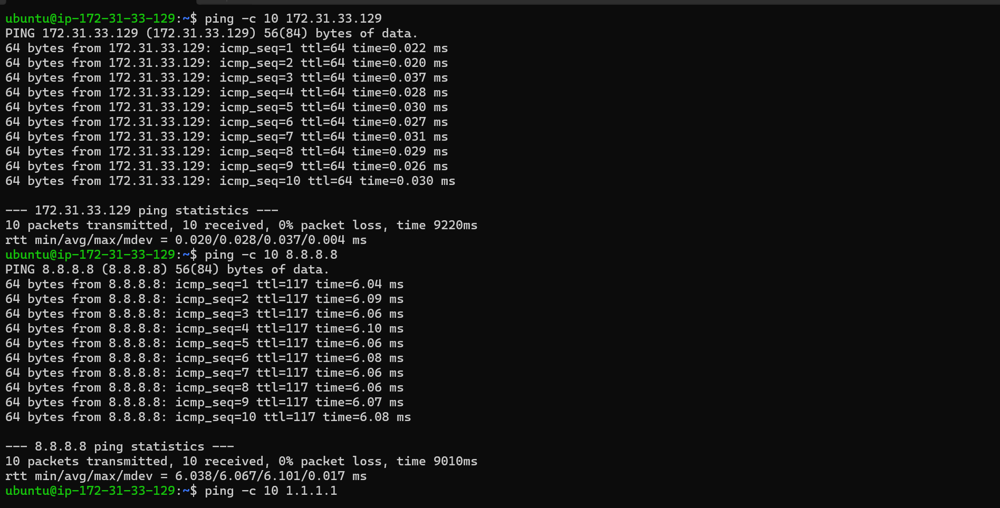

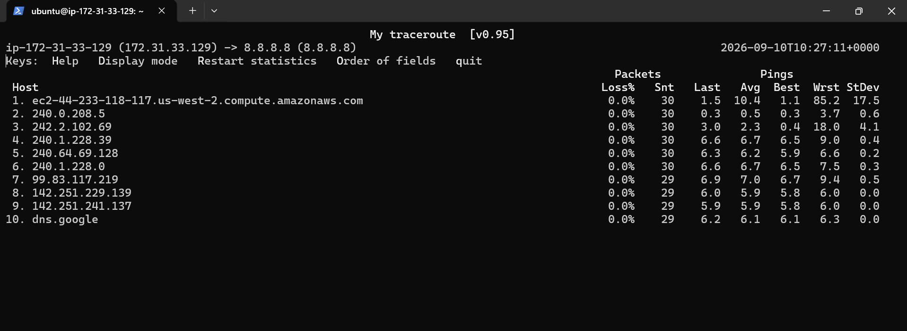

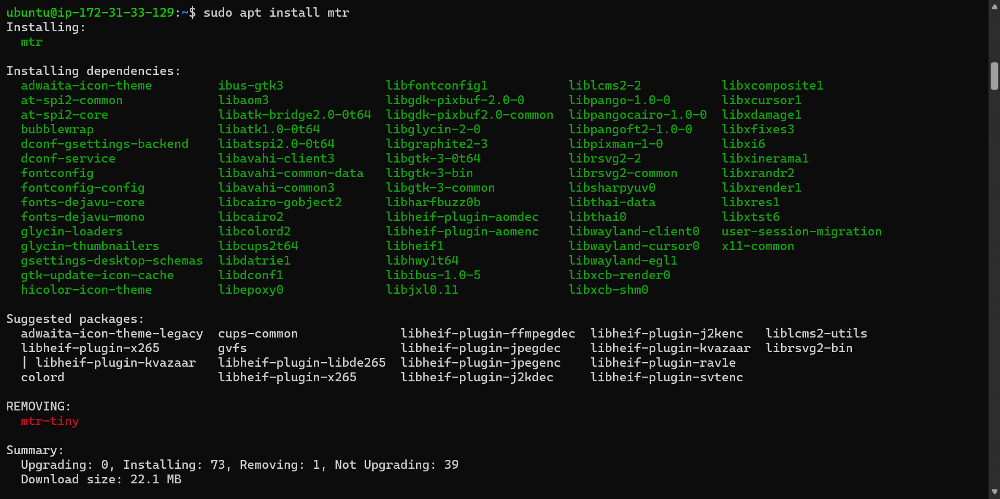
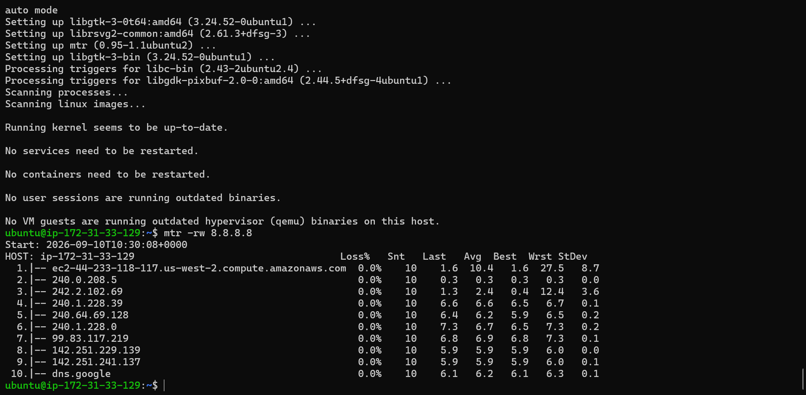
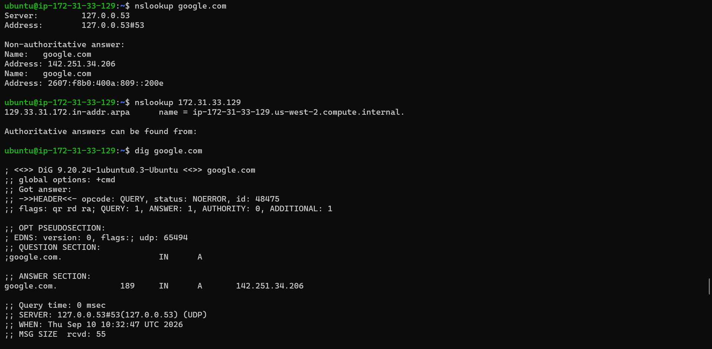
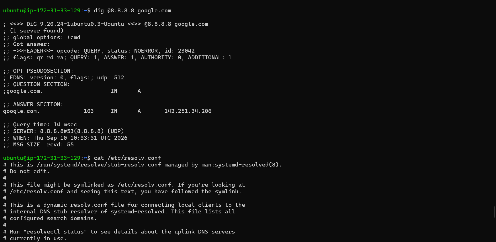
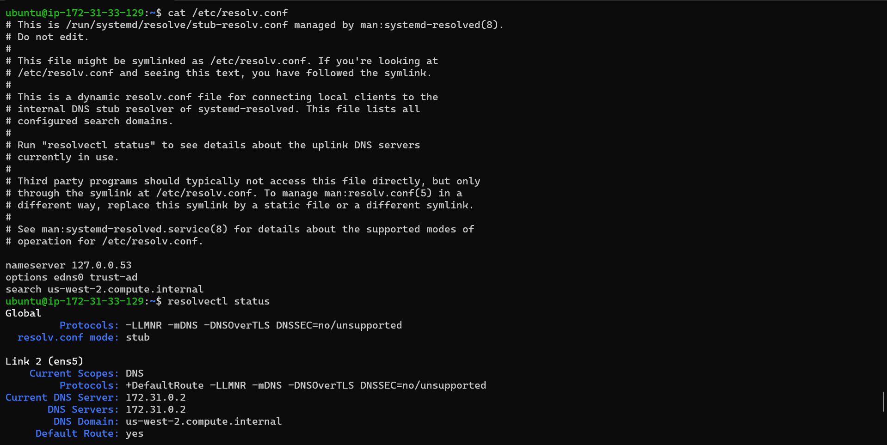
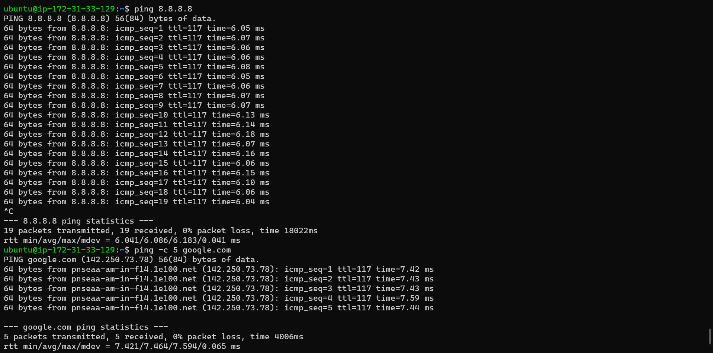

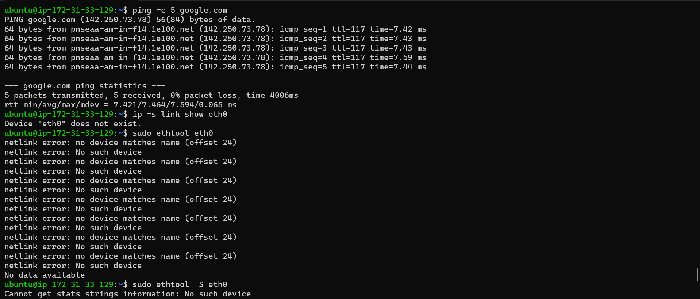
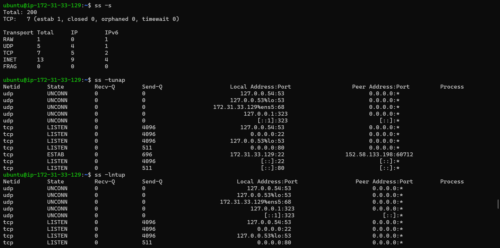
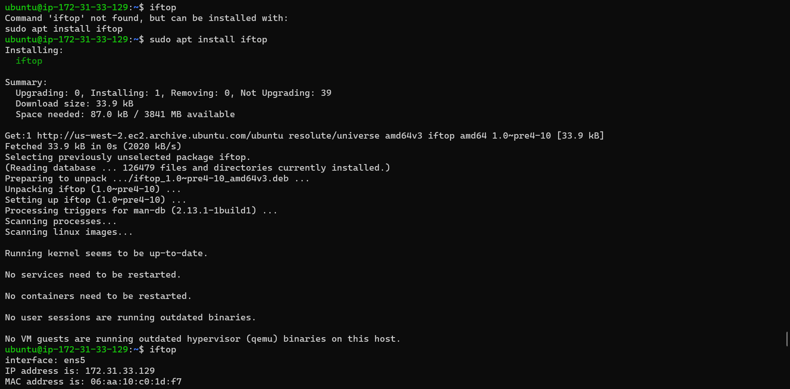
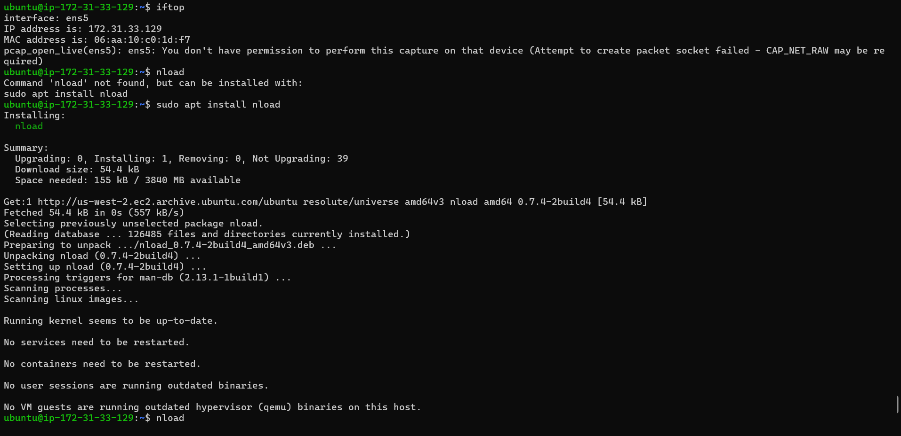
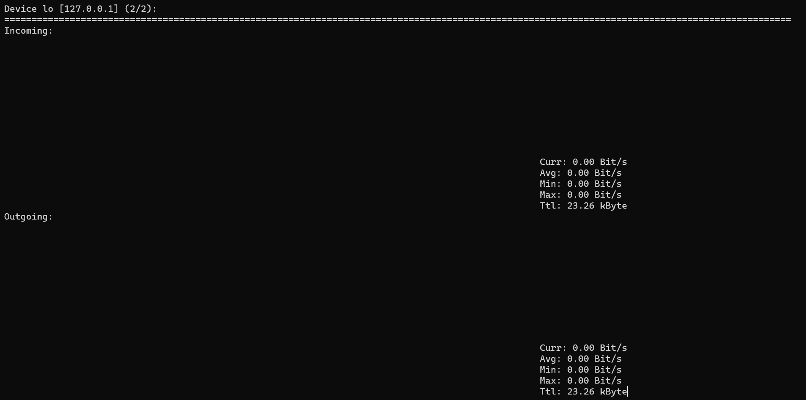
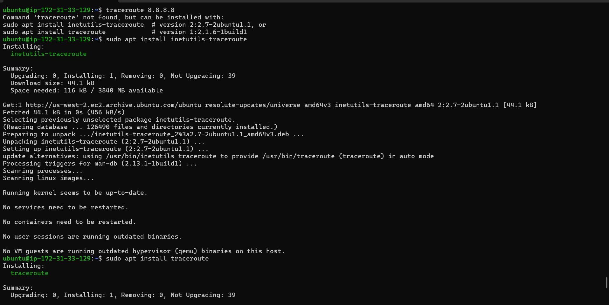
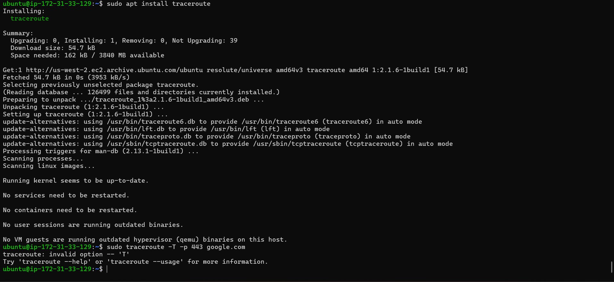
