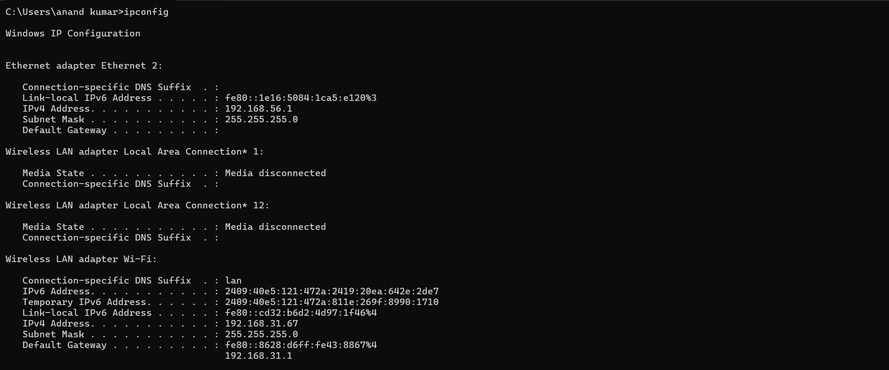
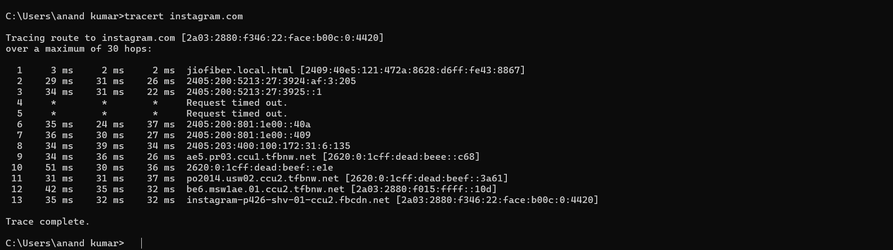
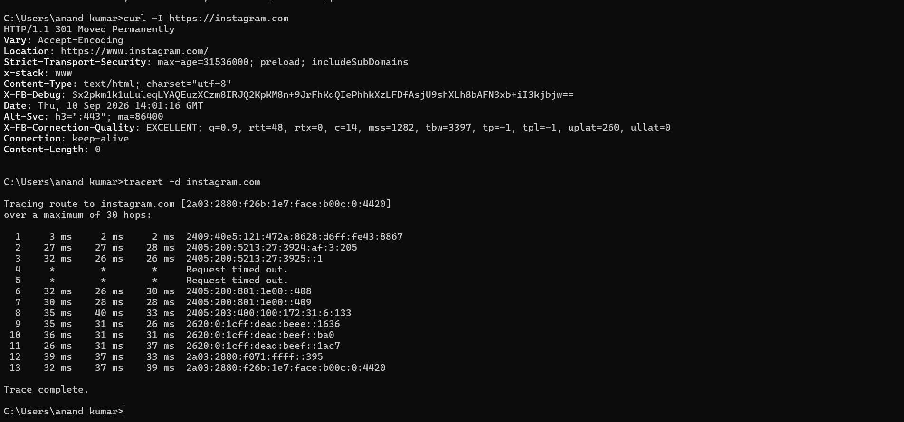
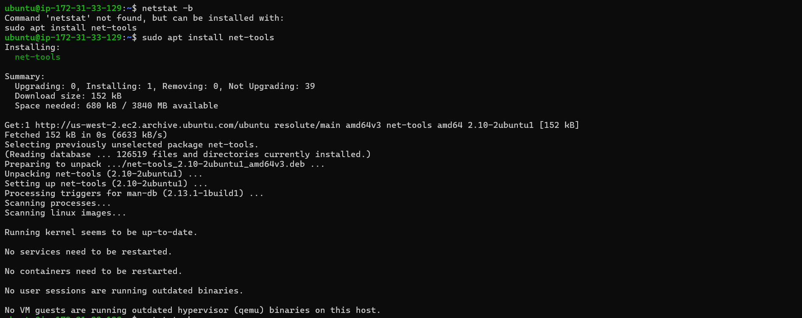
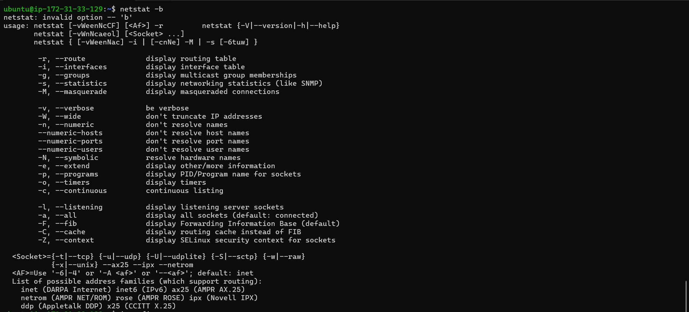
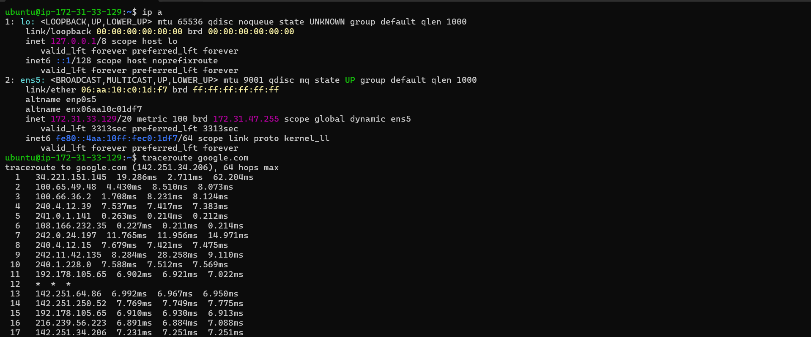
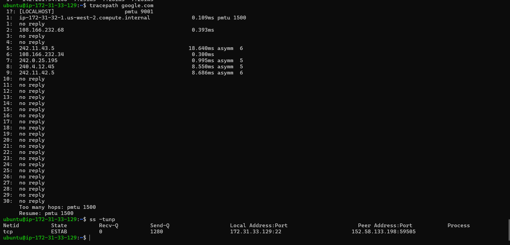

# Linux & Windows Network Troubleshooting Commands
---
* Windows: ipconfig, tracert, curl, Invoke-WebRequest, netstat
* Linux: ip, traceroute, tracepath, curl, ss, ifconfig
* ipconfig and tracert are Windows commands, so they don't exist by default on Ubuntu.
* Linux netstat does not use Windows' -b option. On Linux, use ss -tunap or netstat -tunap.
---

# Network Troubleshooting Decision Tree

                Application not working
                         │
                         ▼
                 Check IP address
                  `ip a` / `ipconfig`
                         │
                ┌────────┴────────┐
                │                 │
             No IP             IP exists
                │                 │
          Check DHCP             ▼
                         Check default route
                         `ip route` / `route print`
                                  │
                         ┌────────┴────────┐
                         │                 │
                      No route          Route exists
                         │                 │
                    Fix routing             ▼
                                  Ping gateway
                                  `ping <gateway>`
                                           │
                                  ┌────────┴────────┐
                                  │                 │
                                Fail              Pass
                                  │                 │
                         Check LAN/VPC/SG          ▼
                                           Ping public IP
                                           `ping 8.8.8.8`
                                                  │
                                         ┌────────┴────────┐
                                         │                 │
                                       Fail              Pass
                                         │                 │
                                  Check routing/         ▼
                                  firewall/ACL     Test DNS
                                                  `dig` / `nslookup`
                                                         │
                                                ┌────────┴────────┐
                                                │                 │
                                              Fail              Pass
                                                │                 │
                                           Fix DNS               ▼
                                                         Test TCP port
                                                  `nc` / `Test-NetConnection`
                                                                 │
                                                        ┌────────┴────────┐
                                                        │                 │
                                                      Fail              Pass
                                                        │                 │
                                                  Check firewall/          ▼
                                                  Security Group     Test HTTP/HTTPS
                                                                      `curl -I`
                                                                          │
                                                                 ┌────────┴────────┐
                                                                 │                 │
                                                               Fail              Pass
                                                                 │                 │
                                                           Check application     Network OK
                                                           / service / logs

                                                           
## 1. Purpose

This document is a practical reference for checking:

* IP address and network interfaces
* Default gateway and routing
* DNS resolution
* Internet connectivity
* Packet loss
* Network latency
* Network path / hops
* Open TCP/UDP ports
* Listening services
* Active connections
* Process-to-port mapping
* HTTP/HTTPS connectivity
* MTU / Path MTU
* SSH connectivity
* Network statistics
* Firewall-related problems
* Basic network troubleshooting

---

# 2. Windows vs Linux Command Mapping

| Purpose                 | Windows CMD / PowerShell                | Linux                                    |
| ----------------------- | --------------------------------------- | ---------------------------------------- |
| Show IP configuration   | `ipconfig /all`                         | `ip a`                                   |
| Show routing table      | `route print`                           | `ip route`                               |
| Show DNS configuration  | `ipconfig /all`                         | `resolvectl status`                      |
| DNS lookup              | `nslookup google.com`                   | `dig google.com` / `nslookup google.com` |
| Ping                    | `ping google.com`                       | `ping google.com`                        |
| Trace route             | `tracert google.com`                    | `traceroute google.com`                  |
| Trace route without DNS | `tracert -d google.com`                 | `traceroute -n google.com`               |
| Path MTU                | `pathping` / PowerShell tools           | `tracepath google.com`                   |
| Active connections      | `netstat -ano`                          | `ss -tunap`                              |
| Listening ports         | `netstat -ano`                          | `ss -lntup`                              |
| Port/process mapping    | `netstat -ano` + `tasklist`             | `ss -tunap`                              |
| Network interface       | `ipconfig`                              | `ip a`                                   |
| Interface statistics    | `netstat -e`                            | `ip -s link`                             |
| HTTP request            | `curl`                                  | `curl`                                   |
| HTTP request PowerShell | `Invoke-WebRequest`                     | N/A                                      |
| DNS cache               | `ipconfig /displaydns`                  | `resolvectl statistics`                  |
| Flush DNS               | `ipconfig /flushdns`                    | `sudo resolvectl flush-caches`           |
| ARP table               | `arp -a`                                | `ip neigh`                               |
| Hosts file              | `C:\Windows\System32\drivers\etc\hosts` | `/etc/hosts`                             |
| Firewall                | `netsh advfirewall`                     | `ufw` / `iptables` / `nft`               |
| Network statistics      | `netstat -s`                            | `ss -s` / `ip -s link`                   |
| SSH                     | `ssh`                                   | `ssh`                                    |

---

# 3. Windows CMD Networking Commands

## 3.1 Check IP Address

```cmd
ipconfig
```

Shows:

* IPv4 address
* IPv6 address
* Subnet mask
* Default gateway

For detailed information:

```cmd
ipconfig /all
```

Useful when troubleshooting:

* DHCP
* DNS
* Gateway
* MAC address
* IPv4/IPv6
* Network adapter

---

## 3.2 Check DNS Cache

```cmd
ipconfig /displaydns
```

Flush DNS cache:

```cmd
ipconfig /flushdns
```

Renew DHCP:

```cmd
ipconfig /release
ipconfig /renew
```

IPv6:

```cmd
ipconfig /release6
ipconfig /renew6
```

---

# 4. Windows Ping

Basic:

```cmd
ping google.com
```

IPv4:

```cmd
ping -4 google.com
```

IPv6:

```cmd
ping -6 google.com
```

Continuous ping:

```cmd
ping -t google.com
```

Stop with:

```text
Ctrl + C
```

Specify packet count:

```cmd
ping -n 10 google.com
```

Specify packet size:

```cmd
ping -l 1400 google.com
```

### What to check

Example:

```text
Packets: Sent = 4, Received = 4, Lost = 0 (0% loss)
Minimum = 45ms
Maximum = 54ms
Average = 50ms
```

Interpretation:

* `0% loss` → no packet loss observed
* Low average latency → generally good response
* High variation between min/max → possible jitter
* `Request timed out` → target may block ICMP; it does NOT automatically mean the website is down

---

# 5. Windows Traceroute

Windows uses:

```cmd
tracert google.com
```

Without DNS name resolution:

```cmd
tracert -d google.com
```

Example:

```cmd
tracert instagram.com
```

Traceroute shows the network path:

```text
Your PC
   ↓
Home Router
   ↓
ISP
   ↓
ISP Backbone
   ↓
Internet
   ↓
Destination
```

### Important

A hop showing:

```text
* * * Request timed out.
```

does not necessarily mean the connection is broken.

Many routers simply don't respond to traceroute probes.

---

# 6. Windows Path Analysis

```cmd
pathping google.com
```

`pathping` combines ideas from:

* `ping`
* `tracert`

It can help identify packet loss and latency along the path.

Example:

```cmd
pathping google.com
```

---

# 7. Windows DNS Commands

## nslookup

```cmd
nslookup google.com
```

Specific DNS server:

```cmd
nslookup google.com 8.8.8.8
```

IPv4:

```cmd
nslookup -type=A google.com
```

IPv6:

```cmd
nslookup -type=AAAA google.com
```

---

# 8. Windows Routing

Show routing table:

```cmd
route print
```

Show IPv4 routes:

```cmd
route print -4
```

Show IPv6 routes:

```cmd
route print -6
```

PowerShell alternative:

```powershell
Get-NetRoute
```

Default gateway:

```powershell
Get-NetRoute -DestinationPrefix "0.0.0.0/0"
```

---

# 9. Windows ARP / Neighbor Information

```cmd
arp -a
```

PowerShell:

```powershell
Get-NetNeighbor
```

ARP/neighbor information helps troubleshoot local-network communication.

---

# 10. Windows Netstat

Your command:

```cmd
netstat -b
```

returned:

```text
The requested operation requires elevation.
```

That is because `-b` attempts to identify the executable associated with each connection.

Run **Command Prompt as Administrator** and then:

```cmd
netstat -b
```

However, a very useful alternative is:

```cmd
netstat -ano
```

This shows:

* Protocol
* Local address
* Local port
* Remote address
* Remote port
* State
* PID

Example:

```text
TCP    0.0.0.0:22    0.0.0.0:0    LISTENING    1234
```

Find the process:

```cmd
tasklist /FI "PID eq 1234"
```

---

# 11. Windows Netstat Options

```cmd
netstat -a
```

All connections and listening ports.

```cmd
netstat -n
```

Numeric addresses and ports.

```cmd
netstat -o
```

Shows PID.

```cmd
netstat -b
```

Shows executable responsible for connection.

Requires Administrator privileges.

```cmd
netstat -ano
```

One of the most useful troubleshooting commands.

```cmd
netstat -anob
```

Shows:

* Connections
* Numeric addresses
* PID
* Executable

Usually requires Administrator CMD.

---

# 12. PowerShell Network Commands

PowerShell provides more modern networking commands.

## Network adapters

```powershell
Get-NetAdapter
```

Detailed:

```powershell
Get-NetAdapter | Format-List
```

---

## IP addresses

```powershell
Get-NetIPAddress
```

IPv4:

```powershell
Get-NetIPAddress -AddressFamily IPv4
```

---

## Routes

```powershell
Get-NetRoute
```

---

## DNS

```powershell
Get-DnsClientServerAddress
```

---

## ARP / Neighbor table

```powershell
Get-NetNeighbor
```

---

## TCP connections

```powershell
Get-NetTCPConnection
```

Listening TCP ports:

```powershell
Get-NetTCPConnection -State Listen
```

Established connections:

```powershell
Get-NetTCPConnection -State Established
```

Find a specific port:

```powershell
Get-NetTCPConnection -LocalPort 443
```

---

# 13. PowerShell Test-NetConnection

This is extremely useful.

Basic:

```powershell
Test-NetConnection google.com
```

Test a specific TCP port:

```powershell
Test-NetConnection google.com -Port 443
```

SSH:

```powershell
Test-NetConnection SERVER_IP -Port 22
```

HTTP:

```powershell
Test-NetConnection example.com -Port 80
```

HTTPS:

```powershell
Test-NetConnection example.com -Port 443
```

Traceroute-style test:

```powershell
Test-NetConnection google.com -TraceRoute
```

This is especially useful for checking whether a specific TCP port is reachable.

---

# 14. Windows curl

Check HTTP headers:

```cmd
curl -I https://instagram.com
```

Verbose:

```cmd
curl -v https://instagram.com
```

Follow redirects:

```cmd
curl -L https://instagram.com
```

Test HTTPS:

```cmd
curl -I https://google.com
```

Test a specific port:

```cmd
curl -v https://example.com:443
```

---

# 15. PowerShell Invoke-WebRequest

Your command:

```powershell
Invoke-WebRequest -Uri "https://instagram.com"
```

returned:

```text
Invoke-WebRequest: command not found
```

because you were **inside Ubuntu**, not PowerShell.

### Use it on Windows PowerShell:

```powershell
Invoke-WebRequest -Uri "https://instagram.com"
```

Short form:

```powershell
iwr "https://instagram.com"
```

Headers only:

```powershell
Invoke-WebRequest -Uri "https://instagram.com" -Method Head
```

On Linux, use:

```bash
curl -I https://instagram.com
```

---

# 16. Linux Network Interface

Linux does NOT use:

```bash
ipconfig
```

Modern Linux uses:

```bash
ip a
```

or:

```bash
ip addr
```

Specific interface:

```bash
ip addr show ens5
```

Your EC2 interface was:

```text
ens5
```

with:

```text
172.31.33.129/20
```

---

# 17. Linux Interface Status

```bash
ip link
```

Specific interface:

```bash
ip link show ens5
```

Bring interface up:

```bash
sudo ip link set ens5 up
```

Bring interface down:

```bash
sudo ip link set ens5 down
```

Be careful with `down` on a remote EC2 server because you can disconnect yourself.

---

# 18. Linux Routing Table

```bash
ip route
```

Example:

```text
default via 172.31.32.1 dev ens5
172.31.32.0/20 dev ens5
```

Meaning:

```text
Destination       Gateway          Interface

Internet          172.31.32.1      ens5
172.31.32.0/20    directly connected
```

Show IPv6 routes:

```bash
ip -6 route
```

---

# 19. Linux Ping

```bash
ping google.com
```

IPv4:

```bash
ping -4 google.com
```

IPv6:

```bash
ping -6 google.com
```

Send 10 packets:

```bash
ping -c 10 google.com
```

Packet size:

```bash
ping -s 1400 google.com
```

---

# 20. Linux Traceroute

Install if necessary:

```bash
sudo apt install traceroute
```

Run:

```bash
traceroute google.com
```

Numeric mode:

```bash
traceroute -n google.com
```

IPv4:

```bash
traceroute -4 google.com
```

IPv6:

```bash
traceroute -6 google.com
```

---

# 21. Linux Tracepath

You used:

```bash
tracepath google.com
```

This is very useful because it can also help identify:

* Path MTU
* Network path
* Intermediate hops
* Asymmetric routing

Example:

```text
pmtu 1500
```

means the discovered path MTU is 1500 bytes.

---

# 22. Linux ss — Modern Netstat Replacement

Your command:

```bash
ss -tunp
```

was correct.

Options:

```text
-t = TCP
-u = UDP
-n = numeric
-p = process
```

Therefore:

```bash
ss -tunp
```

means:

> Show TCP/UDP connections using numeric addresses and show the owning process.

---

## All connections

```bash
ss -tunap
```

## Listening TCP ports

```bash
ss -lntp
```

## Listening UDP ports

```bash
ss -lnup
```

## All listening sockets

```bash
ss -lntup
```

## Established connections

```bash
ss -tn state established
```

## Port 22

```bash
ss -lntp | grep :22
```

## Port 80

```bash
ss -lntp | grep :80
```

## Port 443

```bash
ss -lntp | grep :443
```

---

# 23. Linux netstat

Install:

```bash
sudo apt install net-tools
```

You installed this successfully.

Check:

```bash
netstat -tulnp
```

Options:

```text
-t = TCP
-u = UDP
-l = listening
-n = numeric
-p = process
```

All connections:

```bash
netstat -tunap
```

Routing:

```bash
netstat -rn
```

Statistics:

```bash
netstat -s
```

Interfaces:

```bash
netstat -i
```

### Important difference

Windows:

```cmd
netstat -b
```

Linux:

```bash
netstat -b
```

is invalid.

Linux uses:

```bash
netstat -p
```

to show PID/program.

Modern Linux recommendation:

```bash
ss -tunap
```

---

# 24. Linux DNS

Check DNS resolution:

```bash
nslookup google.com
```

Install if needed:

```bash
sudo apt install dnsutils
```

Better DNS tool:

```bash
dig google.com
```

A record:

```bash
dig A google.com
```

AAAA record:

```bash
dig AAAA google.com
```

Specific DNS server:

```bash
dig @8.8.8.8 google.com
```

---

# 25. Linux DNS Resolver

On modern Ubuntu:

```bash
resolvectl status
```

DNS statistics:

```bash
resolvectl statistics
```

Flush DNS:

```bash
sudo resolvectl flush-caches
```

---

# 26. Linux ARP / Neighbor Table

Modern command:

```bash
ip neigh
```

Example:

```text
192.168.1.1 dev eth0 lladdr xx:xx:xx:xx:xx:xx REACHABLE
```

This is similar to Windows:

```cmd
arp -a
```

---

# 27. Linux curl

Headers only:

```bash
curl -I https://google.com
```

Verbose:

```bash
curl -v https://google.com
```

Follow redirects:

```bash
curl -L https://google.com
```

Show HTTP status:

```bash
curl -o /dev/null -s -w "%{http_code}\n" https://google.com
```

Check response time:

```bash
curl -o /dev/null -s -w "DNS: %{time_namelookup}\nConnect: %{time_connect}\nTLS: %{time_appconnect}\nTotal: %{time_total}\n" https://google.com
```

This is very useful for DevOps troubleshooting.

---

# 28. SSH Troubleshooting

Basic:

```bash
ssh ubuntu@SERVER_IP
```

Using PEM key:

```bash
ssh -i server-a.pem ubuntu@SERVER_IP
```

Verbose SSH:

```bash
ssh -v -i server-a.pem ubuntu@SERVER_IP
```

More verbose:

```bash
ssh -vvv -i server-a.pem ubuntu@SERVER_IP
```

Test port 22:

Linux:

```bash
nc -vz SERVER_IP 22
```

Windows PowerShell:

```powershell
Test-NetConnection SERVER_IP -Port 22
```

---

# 29. Your EC2 SSH Connection

You successfully connected to:

```text
Ubuntu 26.04 LTS
```

and received:

```text
IPv4 address for ens5: 172.31.33.129
```

Your interface:

```text
ens5
```

Your private IP:

```text
172.31.33.129
```

Your subnet:

```text
172.31.32.0/20
```

Your default gateway:

```text
172.31.32.1
```

You can verify:

```bash
ip a
ip route
```

---

# 30. Important EC2 Network Troubleshooting Commands

Run:

```bash
ip a
```

Then:

```bash
ip route
```

Then:

```bash
ping -c 4 172.31.32.1
```

Then:

```bash
ping -c 4 8.8.8.8
```

Then:

```bash
ping -c 4 google.com
```

Then:

```bash
dig google.com
```

Then:

```bash
traceroute google.com
```

Then:

```bash
curl -I https://google.com
```

Then:

```bash
ss -tunap
```

This gives a basic troubleshooting sequence.

---

# 31. Network Troubleshooting Flow

Use this order:

```text
1. Check interface
       ↓
2. Check IP address
       ↓
3. Check subnet
       ↓
4. Check default gateway
       ↓
5. Check routing table
       ↓
6. Ping gateway
       ↓
7. Ping public IP
       ↓
8. Test DNS
       ↓
9. Test domain
       ↓
10. Trace route
       ↓
11. Test TCP port
       ↓
12. Test HTTP/HTTPS
       ↓
13. Check listening ports
       ↓
14. Check firewall/security rules
```

---

# 32. Diagnose Common Problems

## Problem: No IP address

Windows:

```cmd
ipconfig /all
```

Linux:

```bash
ip a
```

Check DHCP and interface status.

---

## Problem: Can ping gateway but cannot access Internet

Check:

```bash
ip route
```

Look for:

```text
default via ...
```

Then:

```bash
ping 8.8.8.8
```

If IP works but:

```bash
ping google.com
```

fails, investigate DNS.

---

## Problem: DNS failure

Linux:

```bash
dig google.com
```

Windows:

```cmd
nslookup google.com
```

Check configured DNS servers.

---

## Problem: Domain resolves but website doesn't work

Test:

```bash
curl -I https://example.com
```

Windows:

```powershell
Test-NetConnection example.com -Port 443
```

This separates DNS problems from TCP/HTTPS problems.

---

## Problem: SSH doesn't work

Check from Windows:

```powershell
Test-NetConnection SERVER_IP -Port 22
```

On the server:

```bash
ss -lntp | grep :22
```

Check:

* EC2 Security Group
* Network ACL
* Route table
* Internet Gateway
* Server firewall
* SSH service

---

# 33. Ping vs Traceroute vs Curl

## ping

Answers:

> Can I reach this host using ICMP, and what is the approximate RTT?

```bash
ping google.com
```

---

## traceroute

Answers:

> What network path does traffic appear to take?

```bash
traceroute google.com
```

---

## curl

Answers:

> Can I actually establish an application-layer HTTP/HTTPS connection?

```bash
curl -I https://google.com
```

This distinction is extremely important.

A website can reject/block ICMP ping while HTTPS still works.

Your Instagram test demonstrated exactly this type of situation:

```text
ping → 100% loss
curl → HTTP 301
```

Therefore:

> Ping failure does NOT automatically mean the website is unavailable.

---

# 34. HTTP Status Codes

Common codes:

```text
200 OK
301 Moved Permanently
302 Found
400 Bad Request
401 Unauthorized
403 Forbidden
404 Not Found
429 Too Many Requests
500 Internal Server Error
502 Bad Gateway
503 Service Unavailable
504 Gateway Timeout
```

Your:

```bash
curl -I https://instagram.com
```

returned:

```text
HTTP/2 301
```

This means Instagram is redirecting the request to another URL.

---

# 35. Ports You Should Know

|  Port | Protocol / Service     |
| ----: | ---------------------- |
| 20/21 | FTP                    |
|    22 | SSH                    |
|    23 | Telnet                 |
|    25 | SMTP                   |
|    53 | DNS                    |
| 67/68 | DHCP                   |
|    80 | HTTP                   |
|   110 | POP3                   |
|   123 | NTP                    |
|   143 | IMAP                   |
|   443 | HTTPS                  |
|  3306 | MySQL                  |
|  5432 | PostgreSQL             |
|  6379 | Redis                  |
|  8080 | Common alternate HTTP  |
|  8443 | Common alternate HTTPS |
| 27017 | MongoDB                |

---

# 36. Useful Linux Tools

Install common network troubleshooting tools:

```bash
sudo apt update
sudo apt install -y net-tools traceroute dnsutils curl iproute2 iputils-ping
```

Optional:

```bash
sudo apt install -y mtr-tiny nmap tcpdump netcat-openbsd
```

---

# 37. MTR — Ping + Traceroute

Install:

```bash
sudo apt install mtr-tiny
```

Run:

```bash
mtr google.com
```

Report mode:

```bash
mtr -r -c 10 google.com
```

Useful for investigating:

* Latency
* Packet loss
* Network path
* Intermediate hops

---

# 38. Netcat

Test TCP port:

```bash
nc -vz google.com 443
```

SSH:

```bash
nc -vz SERVER_IP 22
```

HTTP:

```bash
nc -vz SERVER_IP 80
```

---

# 39. Nmap

Install:

```bash
sudo apt install nmap
```

Check common ports:

```bash
nmap SERVER_IP
```

Specific port:

```bash
nmap -p 22 SERVER_IP
```

Multiple ports:

```bash
nmap -p 22,80,443 SERVER_IP
```

Only scan systems you own or are authorized to test.

---

# 40. Tcpdump

Capture traffic:

```bash
sudo tcpdump -i ens5
```

Capture ICMP:

```bash
sudo tcpdump -i ens5 icmp
```

Capture port 22:

```bash
sudo tcpdump -i ens5 port 22
```

Capture HTTPS:

```bash
sudo tcpdump -i ens5 port 443
```

Limit packets:

```bash
sudo tcpdump -i ens5 -c 20
```

This is a powerful packet-level troubleshooting tool.

---

# 41. Linux Firewall

Check UFW:

```bash
sudo ufw status
```

Detailed:

```bash
sudo ufw status verbose
```

Check nftables:

```bash
sudo nft list ruleset
```

Remember:

```text
AWS Security Group
        ↓
AWS Network ACL
        ↓
Linux Firewall
        ↓
Application
```

All can potentially affect connectivity.

---

# 42. Check Listening Services

Linux:

```bash
ss -lntup
```

Alternative:

```bash
sudo lsof -i -P -n
```

Specific port:

```bash
sudo lsof -i :8080
```

---

# 43. Check Network Statistics

Linux:

```bash
ip -s link
```

Socket statistics:

```bash
ss -s
```

Netstat:

```bash
netstat -s
```

Look for:

* RX errors
* TX errors
* Dropped packets
* TCP failures
* Retransmissions

---

# 44. Windows Equivalent Cheat Sheet

```cmd
ipconfig /all
route print
arp -a
ping google.com
tracert google.com
tracert -d google.com
pathping google.com
nslookup google.com
netstat -ano
netstat -anob
curl -I https://google.com
```

PowerShell:

```powershell
Get-NetAdapter
Get-NetIPAddress
Get-NetRoute
Get-NetNeighbor
Get-NetTCPConnection
Test-NetConnection google.com -Port 443
Test-NetConnection google.com -TraceRoute
Invoke-WebRequest -Uri "https://google.com"
```

---

# 45. Linux Equivalent Cheat Sheet

```bash
ip a
ip link
ip route
ip neigh
ping -c 4 google.com
traceroute google.com
traceroute -n google.com
tracepath google.com
ss -tunap
ss -lntup
netstat -tunap
dig google.com
nslookup google.com
curl -I https://google.com
curl -v https://google.com
mtr google.com
nc -vz google.com 443
sudo tcpdump -i ens5
```

---

# 46. Most Important Commands for a DevOps Engineer

If you are learning Linux/DevOps, memorize these first:

```bash
ip a
ip route
ip neigh
ping
traceroute
tracepath
ss
curl
dig
nslookup
nc
mtr
tcpdump
```

And on Windows:

```cmd
ipconfig /all
ping
tracert
pathping
nslookup
arp -a
netstat -ano
curl
```

PowerShell:

```powershell
Get-NetAdapter
Get-NetIPAddress
Get-NetRoute
Get-NetTCPConnection
Test-NetConnection
```

---

# 47. Quick Troubleshooting Example

Suppose:

```text
Application is not accessible
```

Start with:

### Step 1 — Interface

```bash
ip a
```

### Step 2 — Route

```bash
ip route
```

### Step 3 — Gateway

```bash
ping -c 4 172.31.32.1
```

### Step 4 — Internet IP

```bash
ping -c 4 8.8.8.8
```

### Step 5 — DNS

```bash
dig google.com
```

### Step 6 — Domain connectivity

```bash
ping -c 4 google.com
```

### Step 7 — Route

```bash
traceroute google.com
```

### Step 8 — HTTPS

```bash
curl -I https://google.com
```

### Step 9 — TCP port

```bash
nc -vz google.com 443
```

### Step 10 — Local service

```bash
ss -lntup
```

### Step 11 — Firewall

```bash
sudo ufw status
```

### Step 12 — Packet capture

```bash
sudo tcpdump -i ens5 port 443
```

---

# 48. Important Lessons From My Practice

## Windows

`ipconfig` is for Windows.

```cmd
ipconfig /all
```

## Linux

`ip` is the modern Linux networking tool.

```bash
ip a
ip route
```

## Windows traceroute

```cmd
tracert google.com
```

## Linux traceroute

```bash
traceroute google.com
```

## Windows HTTP

```powershell
Invoke-WebRequest -Uri "https://instagram.com"
```

## Linux HTTP

```bash
curl -I https://instagram.com
```

## Windows socket information

```cmd
netstat -ano
```

## Linux socket information

```bash
ss -tunap
```

## Linux `netstat -b`

Invalid.

Use:

```bash
netstat -tunap
```

or preferably:

```bash
ss -tunap
```

---

# 49. Golden Troubleshooting Rule

When troubleshooting networking, don't immediately assume:

```text
Ping failed = Website is down
```

Instead test different layers:

```text
Layer 3 — IP connectivity
        ↓
ping

Routing
        ↓
ip route / tracert / traceroute

DNS
        ↓
dig / nslookup

Layer 4 — TCP
        ↓
nc / Test-NetConnection

Layer 7 — HTTP/HTTPS
        ↓
curl / Invoke-WebRequest

Application
        ↓
logs / service status
```

This approach helps identify **where the failure actually occurs**.

---

# 50. One-Line Memory Trick

```text
IP → Route → Ping → DNS → Trace → Port → HTTP → Socket → Firewall → Packet Capture
```

Remember:

```text
ip a
   ↓
ip route
   ↓
ping
   ↓
dig
   ↓
traceroute
   ↓
nc
   ↓
curl
   ↓
ss
   ↓
firewall
   ↓
tcpdump
```

This is a strong basic network troubleshooting workflow for Linux/Cloud/DevOps interviews and real EC2 troubleshooting.








